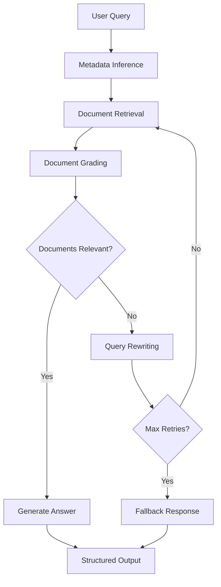

# RAG System with CRAG Workflow

A production-ready Retrieval-Augmented Generation system implementing Corrective RAG (CRAG) workflow with intelligent document processing, metadata inference, and multi-step query refinement.

## 🚀 Features

- **CRAG Workflow**: Multi-step retrieval with document grading and query rewriting
- **Intelligent Metadata Inference**: Automatically extracts and infers document metadata from queries
- **Document Versioning**: Supports versioned documents with effective dates
- **Real-time Processing**: Background document ingestion with live status updates
- **Modern Frontend**: React-based chat interface with admin panel
- **Local LLM**: Configurable Ollama models for privacy and control
- **Vector Search**: Weaviate database with multilingual embeddings
- **Structured Outputs**: Pydantic models ensure consistent API responses

## 🏗️ Architecture

The system processes documents through intelligent chunking and embedding, stores them in a vector database, and uses a multi-step CRAG workflow to retrieve relevant information and generate accurate answers.

### Components
- **Backend API** (FastAPI): Document ingestion and CRAG workflow orchestration
- **Frontend** (React): Modern web interface with chat and admin features
- **Vector Database** (Weaviate): Document embeddings with metadata
- **LLM Server** (Ollama): Local language model inference
- **Workflow Engine** (LangGraph): CRAG pipeline orchestration

## 📋 Installation

### Prerequisites
- Docker and Docker Compose
- 8GB+ RAM recommended

### Setup

1. **Clone and configure**:
   ```bash
   git clone <repository-url>
   cd rag_docker
   echo "OLLAMA_MODEL=mistral-small3.2:latest" > .env
   ```

2. **Start all services**:
   ```bash
   docker compose up -d
   ```

3. **Access the system**:
   - **Frontend**: http://localhost:3000
   - **API Docs**: http://localhost:8002/docs

## 🔄 CRAG Workflow



## 📚 API Usage

### Document Upload
```bash
curl -X POST "http://localhost:8002/ingest" \
  -H "Content-Type: multipart/form-data" \
  -F "files=@document.pdf"
```

### Query Documents
```bash
curl -X POST "http://localhost:8002/query" \
  -H "Content-Type: application/json" \
  -d '{"query": "What are the safety procedures?"}'
```

### Inspect Database
```bash
curl "http://localhost:8002/inspect"
```

### Clear Database
```bash
curl -X DELETE "http://localhost:8002/clear" \
  -H "Content-Type: application/json" \
  -d '{"index_name": null}'
```

## 📁 Document Naming Convention

Use this format for automatic metadata extraction:
```
<doc_id>__v<version>__<effective_date>.extension
```

**Examples**:
- `SOP_Safety__v2__2023-06-15.pdf`
- `Manual_Operations__v1__2024-01-01.docx`

**Fallbacks**:
- Missing version → `unknown`
- Missing date → upload timestamp
- Missing doc_id → filename

## 🛠️ Development

```bash
# Backend development
cd backend
python -m venv myenv && source myenv/bin/activate
pip install -r requirements.txt
export OLLAMA_MODEL=mistral-small3.2:latest
docker-compose up weaviate ollama -d
uvicorn main:app --host 0.0.0.0 --port 8002 --reload

# Frontend development
cd frontend/lovable-frontend
npm install
npm run dev
```

## 🐛 Troubleshooting

**Ollama model issues**:
```bash
docker-compose logs ollama
docker-compose exec ollama ollama list
```

**Weaviate connection**:
```bash
curl http://localhost:8080/v1/meta
```

**Memory issues**:
```bash
docker stats
# Increase Docker memory to 8GB+
```

---

**Built with ❤️ using FastAPI, TypeScript, LangGraph, Weaviate, and Ollama**
