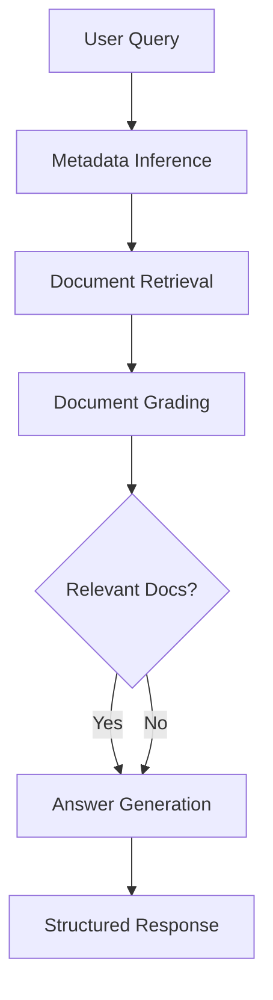

# RAG System with LangGraph and Docker

A comprehensive Retrieval-Augmented Generation (RAG) system built with FastAPI, LangGraph, Weaviate vector database, and Ollama for local LLM inference. The system implements a CRAG (Corrective RAG) workflow with intelligent document processing, metadata inference, and structured outputs using Pydantic models.

## 🏗️ Architecture

### Core Components
- **FastAPI**: REST API backend with async document ingestion and querying
- **Weaviate**: Vector database for document storage and similarity search
- **Ollama**: Local LLM inference server (gemma3:1b model)
- **LangGraph**: Workflow orchestration for CRAG pipeline
- **HuggingFace Embeddings**: Multilingual text embeddings (paraphrase-multilingual-MiniLM-L12-v2)
- **Streamlit**: Web UI for document management and querying
- **Docker Compose**: Containerized deployment with service orchestration

### Key Features
- **Intelligent Metadata Inference**: Automatically extracts and infers document metadata from queries
- **Structured Outputs**: Uses Pydantic models with LangChain's `with_structured_output()` for validation
- **CRAG Workflow**: Multi-step retrieval, grading, and generation pipeline
- **Document Versioning**: Supports versioned documents with effective dates
- **Background Processing**: Async document ingestion with real-time status updates
- **Centralized Model Management**: Single ModelService class for all LLM and embedding operations

## 🚀 Quick Start

### 1. Clone and Setup

```bash
git clone <repository-url>
cd rag_docker
```

### 2. Environment Configuration

Create a `.env` file in the root directory:

```env
# Required: Ollama model configuration
OLLAMA_MODEL=YOUR OLLAMA MODEL NAME GOES HERE

```

### 3. Start Services

```bash
# Start all services (FastAPI, Weaviate, Ollama, Streamlit)
docker compose up -d

```

### 4. Verify Setup

Wait for all services to be ready (Ollama model download may take several minutes):

```bash
# Check FastAPI health and API docs
curl http://localhost:8002/docs

# Check Weaviate database
curl http://localhost:8080/v1/meta

# Check Ollama model availability
curl http://localhost:11434/api/tags

# Access Streamlit UI
open http://localhost:8501
```

## 🌐 User Interfaces

### Streamlit Web UI
- **URL**: http://localhost:8501
- **Features**:
  - Document upload interface
  - Interactive querying
  - Database inspection tools
  - Index management (clear/reset)

### API Documentation
- **Swagger UI**: http://localhost:8002/docs
- **ReDoc**: http://localhost:8002/redoc

## 📚 API Endpoints

### 📤 Document Ingestion

**Endpoint**: `POST /ingest`

Uploads and processes documents for vector storage with background processing.

**Supported Formats**: PDF, DOC, DOCX, TXT

**Key Features**:
- Automatic metadata extraction from filename using pattern: `<doc_id>__v<version>__<effective_date>.extension`
- Document chunking with RecursiveCharacterTextSplitter
- Multilingual embedding generation
- Background processing with FastAPI BackgroundTasks
- Multiple file upload support

**Filename Convention**:
- **Format**: `<doc_id>__v<version>__<effective_date>.extension`
- **Example**: `SOP_Extrusion__v3__2023-01-01.pdf`
- **Fallbacks**:
  - `doc_id`: 'unknown' if not parseable
  - `version`: 'unknown' if not found
  - `effective_date`: upload timestamp if not provided

**Request Example**:
```bash
curl -X POST "http://localhost:8002/ingest" \
  -H "Content-Type: multipart/form-data" \
  -F "files=@document1.pdf" \
  -F "files=@document2.pdf"
```

**Response**:
```json
{
  "message": "Processing started",
  "files": [
    {
      "filename": "SOP_Extrusion__v3__2023-01-01.pdf",
      "status": "processing"
    }
  ]
}
```

### 🔍 Document Querying

**Endpoint**: `POST /query`

Executes the CRAG (Corrective RAG) workflow for intelligent document retrieval and answer generation.

**CRAG Workflow Steps**:
1. **Metadata Inference**: Analyzes query against available database metadata
2. **Document Retrieval**: Vector similarity search with metadata filtering
3. **Document Grading**: Relevance assessment using structured outputs
4. **Answer Generation**: LLM-based response with source tracking

**Key Features**:
- Intelligent metadata inference from natural language queries
- Structured outputs using Pydantic models (`DocumentGrade`, `GeneratedAnswer`)
- Fallback metadata handling for robust querying
- Source document tracking and citation
- Multi-language support

**Request Schema**:
```json
{
  "query": "string"
}
```

**Request Example**:
```bash
curl -X POST "http://localhost:8002/query" \
  -H "Content-Type: application/json" \
  -d '{
    "query": "What are the steps to access the spindle of the automatic pigment weigher?"
  }'
```

**Response Schema**:
```json
{
  "answer": "string",
  "metadata_used": {
    "doc_id": "string",
    "version": "string",
    "effective_date": "string"
  },
  "sources": [
    {
      "content": "string",
      "metadata": {
        "doc_id": "string",
        "source": "string",
        "page": "number"
      }
    }
  ]
}
```

### 🔍 Database Inspection

**Endpoint**: `GET /inspect`

Provides comprehensive information about the Weaviate database structure and stored documents.

**Features**:
- Collection schema and configuration details
- Document count and storage statistics
- Metadata distribution analysis
- Sample data preview

**Request Example**:
```bash
curl "http://localhost:8002/inspect"
```

**Response Structure**:
```json
{
  "collections": {
    "database_info": {
      "url": "http://weaviate:8080",
      "grpc_port": 50051,
      "total_collections": 1
    },
    "collections": [
      {
        "name": "DocumentIndex",
        "description": "Document storage collection",
        "properties": [
          {
            "name": "content",
            "dataType": "text"
          },
          {
            "name": "doc_id",
            "dataType": "text"
          },
          {
            "name": "version",
            "dataType": "text"
          },
          {
            "name": "effective_date",
            "dataType": "text"
          }
        ],
        "total_objects": 150,
        "sample_metadata": {
          "doc_ids": ["SOP_Extrusion", "Manual_Safety"],
          "versions": ["v1", "v2", "v3"],
          "effective_dates": ["2023-01-01", "2023-06-15"]
        }
      }
    ]
  }
}
```

### 🧹 Index Management

**Endpoint**: `DELETE /clear`

Clears Weaviate collections with detailed reporting.

**Features**:
- Clear specific collections or all collections
- Document count reporting before deletion
- Error handling and partial success reporting
- Detailed operation logging

**Request Schema**:
```json
{
  "index_name": "string or null"  // null clears all collections
}
```

**Request Examples**:
```bash
# Clear all collections
curl -X DELETE "http://localhost:8002/clear" \
  -H "Content-Type: application/json" \
  -d '{"index_name": null}'

# Clear specific collection
curl -X DELETE "http://localhost:8002/clear" \
  -H "Content-Type: application/json" \
  -d '{"index_name": "DocumentIndex"}'
```

## 🔄 CRAG Workflow Implementation

The system implements a sophisticated Corrective Retrieval-Augmented Generation workflow using LangGraph:

### Workflow Architecture



### Workflow Steps

1. **Metadata Inference** (`ModelService.infer_metadata_from_query`)
   - Retrieves all available metadata from Weaviate database
   - Uses LLM with structured output (`MetadataInference` schema) to match query to metadata
   - Fallback to default values if inference fails

2. **Document Retrieval** (`retrieval_pipeline`)
   - Vector similarity search using HuggingFace embeddings
   - Metadata filtering based on inferred parameters
   - Custom retriever implementation with configurable parameters

3. **Document Grading** (`CRAGService.grade_documents`)
   - Uses structured output with `DocumentGrade` schema
   - Assesses relevance of retrieved documents to user query
   - Binary classification: "yes" or "no" for relevance

4. **Answer Generation** (`CRAGService.generate_answer`)
   - Uses structured output with `GeneratedAnswer` schema
   - Generates comprehensive answers regardless of document grade
   - Includes source tracking and citation information

### Structured Outputs

All LLM interactions use Pydantic models with LangChain's `with_structured_output()`:

- **`MetadataInference`**: For intelligent metadata matching
- **`DocumentGrade`**: For document relevance assessment
- **`GeneratedAnswer`**: For final answer generation with sources
- **`QueryMetadata`**: For direct metadata extraction (legacy support)

## 🛠️ Development

### Local Development Setup

```bash
# Create virtual environment
python -m venv myenv
source myenv/bin/activate  # On Windows: myenv\Scripts\activate

# Install dependencies
pip install -r requirements.txt

# Set environment variables
export OLLAMA_MODEL=gemma3:1b

# Start infrastructure services
docker-compose up weaviate ollama -d

# Run FastAPI in development mode
uvicorn main:app --host 0.0.0.0 --port 8002 --reload

# Run Streamlit UI (optional)
cd streamlit_app
streamlit run app.py --server.port=8501
```

### Testing the System

```bash
# Test document ingestion
curl -X POST "http://localhost:8002/ingest" \
  -H "Content-Type: multipart/form-data" \
  -F "files=@SOP_Example__v1__2023-01-01.pdf"

# Test intelligent querying
curl -X POST "http://localhost:8002/query" \
  -H "Content-Type: application/json" \
  -d '{"query": "What are the safety procedures in the SOP document?"}'

# Inspect database structure
curl "http://localhost:8002/inspect"

# Clear all indexes
curl -X DELETE "http://localhost:8002/clear" \
  -H "Content-Type: application/json" \
  -d '{"index_name": null}'
```

### Project Structure

```
rag_docker/
├── main.py                    # FastAPI application with lifespan management
├── tasks.py                   # Background document ingestion tasks
├── utils.py                   # Utility functions (metadata extraction, Weaviate utils)
├── logger.py                  # Centralized logging configuration
├── schemas.py                 # Pydantic models for structured outputs
├── requirements.txt           # Python dependencies
├── Dockerfile                 # FastAPI container configuration
├── docker-compose.yml         # Multi-service orchestration
├── .env                       # Environment variables
├── local_models/              # Downloaded HuggingFace models
│   └── paraphrase-multilingual-MiniLM-L12-v2/
├── streamlit_app/             # Web UI application
│   ├── app.py                 # Streamlit interface
│   ├── Dockerfile             # UI container configuration
│   └── requirements.txt       # UI dependencies
├── storage/                   # Application data
│   └── logs/                  # Application logs
└── services/                  # Core business logic
    ├── crag.py                # CRAG workflow with LangGraph
    ├── custom_retriever.py    # Custom Weaviate retriever
    ├── llms.py                # Model configurations (Ollama, HF embeddings)
    ├── model.py               # Centralized ModelService class
    ├── retrieval_pipeline.py  # Document retrieval pipeline
    └── splitter.py            # Document chunking service
```

## 🐛 Troubleshooting

### Common Issues

1. **Ollama Model Download Fails**
   ```bash
   # Check Ollama logs
   docker-compose logs ollama

   # Manually pull model
   docker-compose exec ollama ollama pull gemma3:1b

   # Verify model is available
   docker-compose exec ollama ollama list
   ```

2. **Weaviate Connection Issues**
   ```bash
   # Check Weaviate health
   curl http://localhost:8080/v1/meta

   # Check GRPC port connectivity
   curl http://localhost:50051

   # Restart Weaviate with fresh data
   docker-compose down
   docker volume rm rag_docker_weaviate_data
   docker-compose up weaviate -d
   ```

3. **Embedding Model Download Issues**
   ```bash
   # Check if model is downloaded
   ls -la local_models/paraphrase-multilingual-MiniLM-L12-v2/

   # Clear and re-download
   rm -rf local_models/
   docker-compose restart fastapi
   ```

4. **FastAPI Startup Issues**
   ```bash
   # Check FastAPI logs
   docker-compose logs fastapi

   # Verify environment variables
   docker-compose exec fastapi env | grep -E "(OLLAMA|WEAVIATE)"

   # Test API health
   curl http://localhost:8002/docs
   ```

5. **Memory Issues**
   ```bash
   # Check container memory usage
   docker stats

   # Increase Docker memory limit (Docker Desktop)
   # Settings > Resources > Memory > 8GB+

   # Monitor Ollama memory usage specifically
   docker-compose exec ollama ps aux
   ```

### Logs and Monitoring

```bash
# View all service logs with timestamps
docker-compose logs -f --timestamps

# View specific service logs
docker-compose logs -f fastapi
docker-compose logs -f weaviate
docker-compose logs -f ollama
docker-compose logs -f streamlit

# Check service health and ports
docker-compose ps

# Monitor resource usage
docker stats --format "table {{.Container}}\t{{.CPUPerc}}\t{{.MemUsage}}"
```

### Performance Monitoring

```bash
# Check FastAPI application logs
tail -f storage/logs/app.log

# Monitor Weaviate performance
curl http://localhost:8080/v1/meta | jq '.modules'

# Test embedding generation speed
time curl -X POST "http://localhost:8002/query" \
  -H "Content-Type: application/json" \
  -d '{"query": "test query"}'
```

## 🔒 Security Considerations

### Environment Security
- Store sensitive configuration in `.env` file (never commit to version control)
- Use Docker secrets for production deployments
- Implement proper network isolation between services
- Consider implementing authentication/authorization for production use

### Data Security
- Documents are processed and stored locally (no external API calls for embeddings)
- Weaviate data persists in Docker volumes
- Consider encryption at rest for sensitive documents
- Implement proper access controls for production environments

### Dependencies
- Regularly update Docker images and Python dependencies
- Monitor for security vulnerabilities in dependencies
- Use specific version tags instead of `latest` for production

## 📈 Performance Optimization

### Model Configuration
- **Embedding Model**: Uses local HuggingFace model (paraphrase-multilingual-MiniLM-L12-v2)
- **LLM**: Ollama with gemma3:1b for fast local inference
- **Chunk Size**: Optimized for document type and content structure
- **Vector Dimensions**: Balanced for accuracy vs. storage efficiency

### System Optimization
- **Background Processing**: Async document ingestion prevents API blocking
- **Model Preloading**: Embedding model preloaded during startup
- **Connection Pooling**: Efficient Weaviate connection management
- **Structured Outputs**: Reduces LLM response parsing overhead

### Scaling Considerations
- **Horizontal Scaling**: Add multiple FastAPI instances behind load balancer
- **Database Scaling**: Weaviate supports clustering for large datasets
- **Caching**: Implement Redis for frequently accessed queries
- **Batch Processing**: Process multiple documents simultaneously

## 🧪 Testing

### Unit Testing
```bash
# Run structured output tests
python test_structured_outputs.py

# Test individual components
python -m pytest services/test_*.py
```

### Integration Testing
```bash
# Test full workflow
./test_integration.sh

# Load testing
ab -n 100 -c 10 http://localhost:8002/query
```

## 🤝 Contributing

1. Fork the repository
2. Create a feature branch (`git checkout -b feature/amazing-feature`)
3. Make your changes following the existing code style
4. Add tests for new functionality
5. Update documentation as needed
6. Commit your changes (`git commit -m 'Add amazing feature'`)
7. Push to the branch (`git push origin feature/amazing-feature`)
8. Open a Pull Request

### Development Guidelines
- Follow PEP 8 for Python code style
- Use type hints for all function parameters and return values
- Add docstrings for all classes and functions
- Update schemas.py for any new structured outputs
- Test with multiple document types and languages

## 📄 License

This project is licensed under the MIT License - see the LICENSE file for details.

## 🆘 Support

### Getting Help
- **Documentation**: Check this README and inline code comments
- **Troubleshooting**: Review the troubleshooting section above
- **Logs**: Use `docker-compose logs -f` to diagnose issues
- **Community**: Open GitHub issues for bugs and feature requests

### Common Support Scenarios
- **Setup Issues**: Verify Docker and docker-compose installation
- **Performance Issues**: Check system resources and model configurations
- **Integration Issues**: Verify network connectivity and environment variables
- **Data Issues**: Use `/inspect` endpoint to verify document ingestion

---

**Built with ❤️ using FastAPI, LangGraph, Weaviate, and Ollama**
