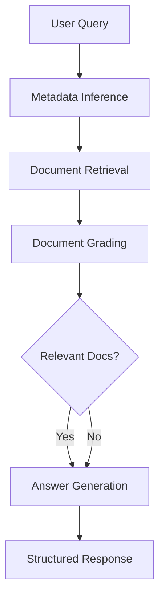

# RAG System with LangGraph and Docker

A production-ready Retrieval-Augmented Generation (RAG) system that intelligently processes documents and answers questions using a CRAG (Corrective RAG) workflow. The system combines local LLM inference with vector search to provide accurate, context-aware responses.

## 🏗️ System Overview

This RAG system processes documents through intelligent chunking and embedding, stores them in a vector database, and uses a multi-step workflow to retrieve relevant information and generate answers. The system automatically infers document metadata from queries and implements fallback mechanisms for robust performance.

### Architecture Components
- **Backend API** (FastAPI): Document ingestion, query processing, and CRAG workflow orchestration
- **Frontend** (React): Modern web interface for document management and interactive querying
- **Vector Database** (Weaviate): Stores document embeddings with metadata for similarity search
- **LLM Server** (Ollama): Local language model inference with configurable models
- **Workflow Engine** (LangGraph): Orchestrates the CRAG pipeline with document grading and query rewriting

### Key Capabilities
- **Smart Document Processing**: Automatic metadata extraction from filenames with versioning support
- **Intelligent Querying**: Infers document metadata from natural language queries
- **CRAG Workflow**: Multi-step retrieval with document relevance grading and query refinement
- **Real-time Processing**: Background document ingestion with live status updates
- **Structured Outputs**: Pydantic models ensure consistent API responses

## 🚀 Quick Start

1. **Clone and configure**:
   ```bash
   git clone <repository-url>
   cd rag_docker
   echo "OLLAMA_MODEL=gemma3:1b" > .env
   ```

2. **Start all services**:
   ```bash
   docker compose up -d
   ```

3. **Access the system**:
   - **Frontend**: http://localhost:3000 (React web interface)
   - **API Docs**: http://localhost:8002/docs (FastAPI Swagger)

## 🌐 User Interfaces

### React Frontend (Primary)
- **URL**: http://localhost:3000
- **Features**: Modern chat interface, document upload, real-time logs, admin panel

### API Documentation
- **Swagger UI**: http://localhost:8002/docs
- **ReDoc**: http://localhost:8002/redoc

## 📚 API Endpoints

### 📤 Document Ingestion

**Endpoint**: `POST /ingest`

Uploads and processes documents for vector storage with background processing.

**Supported Formats**: PDF, DOC, DOCX, TXT

**Key Features**:
- Automatic metadata extraction from filename using pattern: `<doc_id>__v<version>__<effective_date>.extension`
- Document chunking with RecursiveCharacterTextSplitter
- Multilingual embedding generation
- Background processing with FastAPI BackgroundTasks
- Multiple file upload support

**Filename Convention**:
- **Format**: `<doc_id>__v<version>__<effective_date>.extension`
- **Example**: `SOP_Extrusion__v3__2023-01-01.pdf`
- **Fallbacks**:
  - `doc_id`: 'unknown' if not parseable
  - `version`: 'unknown' if not found
  - `effective_date`: upload timestamp if not provided

**Request Example**:
```bash
curl -X POST "http://localhost:8002/ingest" \
  -H "Content-Type: multipart/form-data" \
  -F "files=@document1.pdf" \
  -F "files=@document2.pdf"
```

**Response**:
```json
{
  "message": "Processing started",
  "files": [
    {
      "filename": "SOP_Extrusion__v3__2023-01-01.pdf",
      "status": "processing"
    }
  ]
}
```

### 🔍 Document Querying

**Endpoint**: `POST /query`

Executes the CRAG (Corrective RAG) workflow for intelligent document retrieval and answer generation.

**CRAG Workflow Steps**:
1. **Metadata Inference**: Analyzes query against available database metadata
2. **Document Retrieval**: Vector similarity search with metadata filtering
3. **Document Grading**: Relevance assessment using structured outputs
4. **Answer Generation**: LLM-based response with source tracking

**Key Features**:
- Intelligent metadata inference from natural language queries
- Structured outputs using Pydantic models (`DocumentGrade`, `GeneratedAnswer`)
- Fallback metadata handling for robust querying
- Source document tracking and citation
- Multi-language support

**Request Schema**:
```json
{
  "query": "string"
}
```

**Request Example**:
```bash
curl -X POST "http://localhost:8002/query" \
  -H "Content-Type: application/json" \
  -d '{
    "query": "What are the steps to access the spindle of the automatic pigment weigher?"
  }'
```

**Response Schema**:
```json
{
  "answer": "string",
  "metadata_used": {
    "doc_id": "string",
    "version": "string",
    "effective_date": "string"
  },
  "sources": [
    {
      "content": "string",
      "metadata": {
        "doc_id": "string",
        "source": "string",
        "page": "number"
      }
    }
  ]
}
```

### 🔍 Database Inspection

**Endpoint**: `GET /inspect`

Provides comprehensive information about the Weaviate database structure and stored documents.

**Features**:
- Collection schema and configuration details
- Document count and storage statistics
- Metadata distribution analysis
- Sample data preview

**Request Example**:
```bash
curl "http://localhost:8002/inspect"
```

**Response Structure**:
```json
{
  "collections": {
    "database_info": {
      "url": "http://weaviate:8080",
      "grpc_port": 50051,
      "total_collections": 1
    },
    "collections": [
      {
        "name": "DocumentIndex",
        "description": "Document storage collection",
        "properties": [
          {
            "name": "content",
            "dataType": "text"
          },
          {
            "name": "doc_id",
            "dataType": "text"
          },
          {
            "name": "version",
            "dataType": "text"
          },
          {
            "name": "effective_date",
            "dataType": "text"
          }
        ],
        "total_objects": 150,
        "sample_metadata": {
          "doc_ids": ["SOP_Extrusion", "Manual_Safety"],
          "versions": ["v1", "v2", "v3"],
          "effective_dates": ["2023-01-01", "2023-06-15"]
        }
      }
    ]
  }
}
```

### 🧹 Index Management

**Endpoint**: `DELETE /clear`

Clears Weaviate collections with detailed reporting.

**Features**:
- Clear specific collections or all collections
- Document count reporting before deletion
- Error handling and partial success reporting
- Detailed operation logging

**Request Schema**:
```json
{
  "index_name": "string or null"  // null clears all collections
}
```

**Request Examples**:
```bash
# Clear all collections
curl -X DELETE "http://localhost:8002/clear" \
  -H "Content-Type: application/json" \
  -d '{"index_name": null}'

# Clear specific collection
curl -X DELETE "http://localhost:8002/clear" \
  -H "Content-Type: application/json" \
  -d '{"index_name": "DocumentIndex"}'
```

## 🔄 CRAG Workflow Implementation

The system implements a sophisticated Corrective Retrieval-Augmented Generation workflow using LangGraph:

### Workflow Architecture



### Workflow Steps

1. **Metadata Inference** (`ModelService.infer_metadata_from_query`)
   - Retrieves all available metadata from Weaviate database
   - Uses LLM with structured output (`MetadataInference` schema) to match query to metadata
   - Fallback to default values if inference fails

2. **Document Retrieval** (`retrieval_pipeline`)
   - Vector similarity search using HuggingFace embeddings
   - Metadata filtering based on inferred parameters
   - Custom retriever implementation with configurable parameters

3. **Document Grading** (`CRAGService.grade_documents`)
   - Uses structured output with `DocumentGrade` schema
   - Assesses relevance of retrieved documents to user query
   - Binary classification: "yes" or "no" for relevance

4. **Answer Generation** (`CRAGService.generate_answer`)
   - Uses structured output with `GeneratedAnswer` schema
   - Generates comprehensive answers regardless of document grade
   - Includes source tracking and citation information

### Structured Outputs

All LLM interactions use Pydantic models with LangChain's `with_structured_output()`:

- **`MetadataInference`**: For intelligent metadata matching
- **`DocumentGrade`**: For document relevance assessment
- **`GeneratedAnswer`**: For final answer generation with sources
- **`QueryMetadata`**: For direct metadata extraction (legacy support)

## 🛠️ Development

### Local Development Setup

```bash
# Local development setup
python -m venv myenv && source myenv/bin/activate
pip install -r backend/requirements.txt
export OLLAMA_MODEL=gemma3:1b

# Start infrastructure only
docker-compose up weaviate ollama -d

# Run backend in development mode
cd backend && uvicorn main:app --host 0.0.0.0 --port 8002 --reload
```

### Project Structure

```
rag_docker/
├── backend/                   # FastAPI backend
│   ├── main.py               # API application with lifespan management
│   ├── services/             # Core business logic (CRAG, models, retrieval)
│   ├── schemas.py            # Pydantic models for structured outputs
│   └── utils.py              # Utility functions and Weaviate operations
├── frontend/                 # React frontend application
├── docker-compose.yml        # Multi-service orchestration
└── .env                      # Environment configuration
```

## 🐛 Troubleshooting

### Common Issues

1. **Ollama Model Download Fails**
   ```bash
   # Check Ollama logs
   docker-compose logs ollama

   # Manually pull model
   docker-compose exec ollama ollama pull gemma3:1b

   # Verify model is available
   docker-compose exec ollama ollama list
   ```

2. **Weaviate Connection Issues**
   ```bash
   # Check Weaviate health
   curl http://localhost:8080/v1/meta

   # Check GRPC port connectivity
   curl http://localhost:50051

   # Restart Weaviate with fresh data
   docker-compose down
   docker volume rm rag_docker_weaviate_data
   docker-compose up weaviate -d
   ```

3. **Embedding Model Download Issues**
   ```bash
   # Check if model is downloaded
   ls -la local_models/paraphrase-multilingual-MiniLM-L12-v2/

   # Clear and re-download
   rm -rf local_models/
   docker-compose restart fastapi
   ```

4. **FastAPI Startup Issues**
   ```bash
   # Check FastAPI logs
   docker-compose logs fastapi

   # Verify environment variables
   docker-compose exec fastapi env | grep -E "(OLLAMA|WEAVIATE)"

   # Test API health
   curl http://localhost:8002/docs
   ```

5. **Memory Issues**
   ```bash
   # Check container memory usage
   docker stats

   # Increase Docker memory limit (Docker Desktop)
   # Settings > Resources > Memory > 8GB+

   # Monitor Ollama memory usage specifically
   docker-compose exec ollama ps aux
   ```

## 🤝 Contributing

1. Fork the repository
2. Create a feature branch (`git checkout -b feature/amazing-feature`)
3. Make your changes following the existing code style
4. Add tests for new functionality
5. Update documentation as needed
6. Commit your changes (`git commit -m 'Add amazing feature'`)
7. Push to the branch (`git push origin feature/amazing-feature`)
8. Open a Pull Request
---

**Built with ❤️ using FastAPI, TypeScript, LangGraph, Weaviate, and Ollama**
